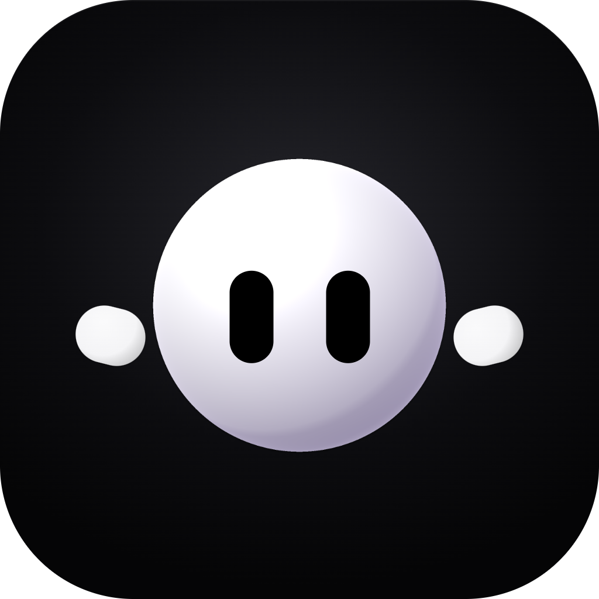
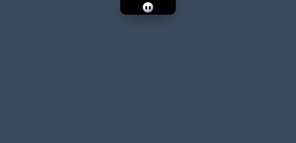
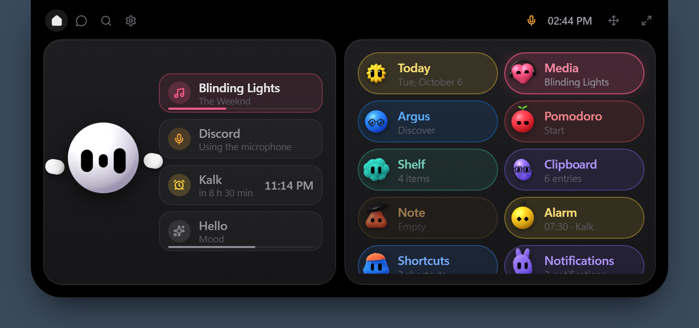
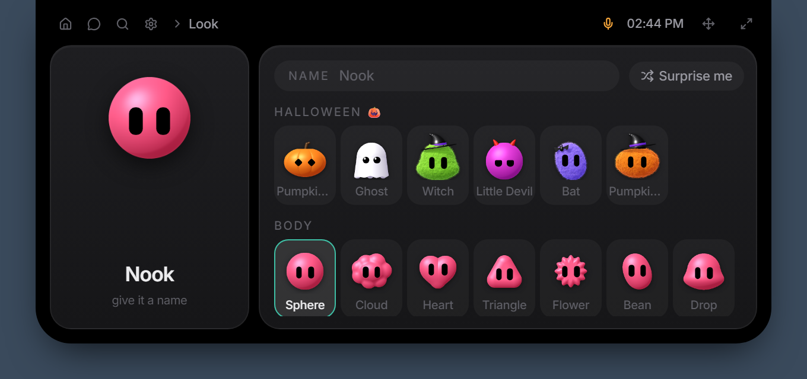
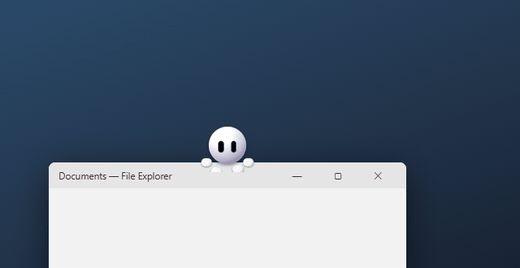
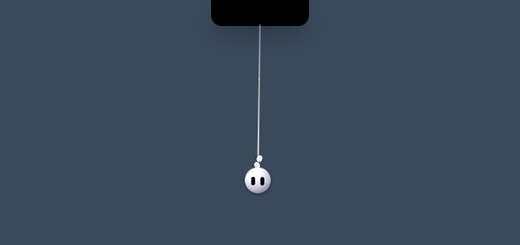
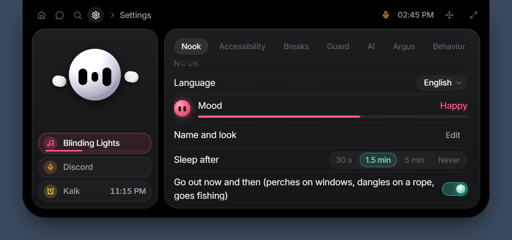

<div align="center">



# Nook

**A little living island for the top of your Windows screen.**
A Dynamic Island–style hub with a 3D mascot that keeps your music, files, alarms and focus in one place — and occasionally wanders off to sit on your windows.

[**⬇ Download for Windows**](https://github.com/lukosovian/nook/releases/latest/download/Nook-setup.exe) · [Instagram @nooktheblob](https://www.instagram.com/nooktheblob/) · [Türkçe](#türkçe)

Windows 10 / 11 · Free · English, Türkçe, Español, Português, Deutsch, Français, Русский, 简体中文, 日本語



</div>

---

## What it does

Move the mouse to the black notch at the top center of your screen and the island opens. Move away and it closes. It never covers your windows and hides itself in games and full-screen video.



| | |
|---|---|
| 🎵 **Media** | Control whatever is playing (Spotify, YouTube, any player) with cover art, a progress bar and synced lyrics |
| 🎧 **Hum** | `Ctrl+Alt+M` — find the song playing in a video or show. Nook puts on DJ headphones, listens to your computer's sound (not the mic) and brings back the title, artist and cover. Auto Hum keeps a history in the background |
| 🤖 **Claude Code** | Watch your Claude Code sessions live, answer permission requests and questions right from the island, get a ping when it's done, and see how much of your plan limit is used (5 hours / week) |
| 📥 **Shelf** | Drag a file onto Nook — it swallows it. Drag it back out anywhere later. Screenshots land here automatically |
| 📋 **Clipboard** | History of copied text and colors; foreign text is translated into your language |
| 📝 **Note · ⏰ Alarm** | Quick scratchpad and alarms that ring even on top of full-screen games — and wait for you until you dismiss them |
| 📅 **Calendar** | Events and reminders (subscribe to a Google / Outlook .ics link too); the notch counts down when one is near |
| 🍅 **Pomodoro** | Focus timer with a **focus guard**: open YouTube or X while working and Nook knocks on the glass |
| 🔎 **Quick search** | `Ctrl+Shift+Space` — open apps, calculate, convert units and currencies, find emoji, search the web |
| 🎛️ **Controls** | Wi-Fi, Bluetooth, dark mode, mic, per-app volume, brightness |
| 📊 **System · Report card** | CPU, memory, network, disk — and a weekly report card of your focus, music and breaks |
| 🔔 **Notifications** | Windows notifications shown on the island (muted while you focus) |
| 🗂️ **Profiles** | Drag chips to reorder or hide them, and keep separate home pages for Work, Games, Fun… Move the island anywhere on screen by its handle |
| 🎮 **Games** | Five mini games to play with Nook |
| ☀️ **Daily brief** | The first time you open it each day: weather, alarms, water, new episodes |
| 🔊 **Sounds** | Soft little sounds when the island opens, a notification arrives or Nook is happy (Settings › Sound) |

### Nook, the mascot

Nook is a little 3D character with moods. Care for it and it's happy; ignore it and it sulks. Grab it and fling it, poke it, feed it files. It reacts to your music, the weather and the time of day.



Dress it up your way: **14 bodies** (sphere, cloud, heart, star, cat, teddy…), **6 textures** (vinyl, plush, matte clay, jelly, metallic, spotted), **20 colors**, glasses, hats, bows and Halloween costumes.

#### Nook goes outside

<table>
<tr>
<td width="50%"><br><b>Perches on your windows.</b> Now and then Nook hops onto the title bar of the window in front. Move the window and it wobbles to keep its balance.</td>
<td width="50%"><br><b>Dangles from the island.</b> Work at the bottom of the screen for a while and it comes down on a rope to watch. Bring the mouse close and it flees back up.</td>
</tr>
<tr>
<td><br><b>Goes fishing.</b> When you're away, Nook sits on the edge of the island and fishes on your desktop — sometimes an old junk file, sometimes a shiny star.</td>
<td><br><b>Guards your focus.</b> During a Pomodoro it sits at its desk. Open a distracting site and it knocks on the glass: <i>"Weren't we working?"</i></td>
</tr>
</table>

### AI (optional)

With a free **Google Gemini** key, Nook can chat, set alarms and timers, take notes, control music and remember things about you. **Ask the screen** (`Ctrl+Shift+A`) lets it look at a screenshot and explain an error; **voice commands** (`Ctrl+Shift+D`, hold) let you just say it. The key is stored only on your computer.

### Privacy

- **Privacy shield** — `Ctrl+Alt+H` covers every screen with one of 22 living Nook scenes (campfire, under the sea, space station, night train…) until you press it again. Music pauses, your microphone is muted for the duration, and you can lock it with a password.
- **Stream mask** — while you share your screen, sensitive sections are hidden.
- **Sensitive data guard** — copy a card number, IBAN, API key or password and Nook keeps it out of history and clears the clipboard after 60 seconds.
- Everything runs on your computer. The only things that go online are: AI requests you make with your own Gemini key, the weather (Open-Meteo, with a rough location from your IP if you don't set a city), currency rates in quick search, translation of copied foreign text (Gemini, or the free MyMemory service if you have no key — can be turned off), and update checks on GitHub.

### Accessibility

- **9 languages** — pick one on the first page of the tour or in Settings › Language. Nook chats in your language too.
- **Interface size** from 80% to 150% for 4K displays and small laptops.
- **Color-blind palettes** for protanopia, deuteranopia and tritanopia.



---

## Install

1. Download [**Nook-setup.exe**](https://github.com/lukosovian/nook/releases/latest/download/Nook-setup.exe) (always the latest version) and run it.
2. Nook isn't code-signed yet, so Windows may show **"Windows protected your PC"**. Click **More info → Run anyway**.
3. Nook starts at the top of your screen and introduces itself. It starts with Windows and **updates itself** (Settings › Version).

**Requirements:** Windows 10 or 11 (64-bit) with Microsoft Edge WebView2 (already included in Windows 11).

**To quit:** right-click the Nook icon in the system tray (bottom right) › Quit Nook. **To uninstall:** Windows Settings › Apps.

### Keyboard shortcuts

| Shortcut | |
|---|---|
| `Ctrl+Shift+Space` | Quick search |
| `Ctrl+Shift+A` | Ask the screen |
| `Ctrl+Shift+D` (hold) | Voice command |
| `Ctrl+Alt+H` | Privacy shield |
| `Ctrl+Alt+M` | Hum — find the playing song |

All of them can be changed in Settings.

### Get a Gemini key (free)

Go to [aistudio.google.com](https://aistudio.google.com), sign in with your Google account, click **Create API key** and paste it into Nook (Settings › AI). Nook picks the best available model on its own.

### FAQ

- **Does it slow down games?** No. When a game or video goes full screen, the island disappears completely and stops drawing.
- **Where is my data?** In Nook's own folder on your computer (`%LOCALAPPDATA%pp.nook.island`). Your notes, clipboard, alarms and settings are never uploaded.
- **What's Argus?** Nook's sibling app for tracking shows and movies. If it's installed, Nook shows your next episodes and can mark what you watched. Nook works fine without it.

---

## Development

Built with [Tauri 2](https://tauri.app) (Rust) and React 19 + TypeScript.

```bash
npm install
npm run tauri dev       # run the app
npm run dev             # just the UI in a browser, with previews:
                        # http://localhost:1420/?preview=home&lang=en
```

- `src-tauri/` — window management, cursor tracking, Windows APIs (audio, brightness, notifications, perching…)
- `src/` — the island UI, the mascot (3D body is a WebGL SDF raymarcher in `src/lib/nook3d.glsl`)
- `src/locales/*.json` — translations. Keys are the Turkish source text; a missing key falls back to Turkish. Fixes and new languages are welcome.
- Releases: bump the version in `package.json`, `src-tauri/tauri.conf.json` and `src-tauri/Cargo.toml`, then `.\release.ps1 "notes"`.

---

## Türkçe

**Nook**, Windows ekranının üst ortasındaki çentikte yaşayan, 3B maskotlu bir "Dynamic Island". Fareyi çentiğe götür, ada açılsın: müzik ve şarkı sözleri, dosya rafı, pano geçmişi, not, alarm, takvim, Pomodoro ve odak bekçisi, hızlı arama, kontrol merkezi, sistem bilgisi, bildirimler, mini oyunlar ve günün özeti hepsi bir arada. Çipleri sürükleyip sıralar, İş / Oyun / Eğlence gibi profiller kurarsın.

**Hum** (`Ctrl+Alt+M`) videoda ya da dizide çalan şarkıyı bulur. **Claude Code** kullanıyorsan oturumlarını adada izler, izin isteklerini ve sorularını terminale dönmeden adadan cevaplarsın; plan limitinin ne kadar dolduğunu da görürsün.

Nook'un keyfi vardır; ilgilenirsen sevinir, unutursan küser. Ara sıra dışarı da çıkar: pencerelerin üstüne tüner, adadan iple sarkar, sen yokken masaüstünde balık tutar. Gemini anahtarınla sohbet eder, ekranına bakar, sesli komutları anlar. Gizlilik kalkanı (`Ctrl+Alt+H`) ekranını 22 canlı Nook sahnesinden biriyle örter, mikrofonunu kapatır, istersen parolayla kilitlenir; hassas veri koruyucusu kopyaladığın şifreyi ve kart numarasını panoda tutmaz. Her şey bilgisayarında kalır. 9 dil, arayüz boyutu ve renk körü paletleri var.

**Kurulum:** [**Nook-setup.exe**](https://github.com/lukosovian/nook/releases/latest/download/Nook-setup.exe)'yi indirip çalıştır (her zaman en yeni sürüm). Windows "bilgisayarınız korundu" derse **Ek bilgi → Yine de çalıştır**. Nook kendini tanıtır, Windows'la açılır ve kendiliğinden güncellenir.

Instagram: [@nooktheblob](https://www.instagram.com/nooktheblob/)
